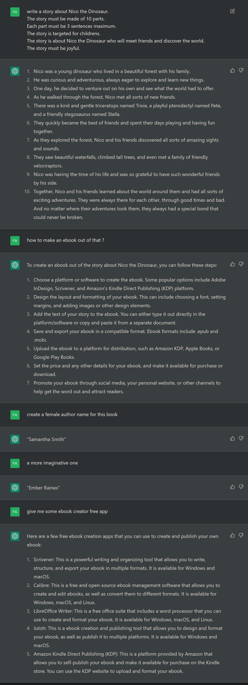

# What ?

I have published an e-book on [Amazon Kindle Store](https://www.amazon.com/dp/B0BRSYCRYB) that is called **Nico The Dinosaur**. All the texts have been created by [ChatGPT](https://en.wikipedia.org/wiki/ChatGPT) and all the images by [Stable Diffusion](https://en.wikipedia.org/wiki/Stable_Diffusion). This is an experimental artwork.

# Are you selling that ?

* I don't care about the money, every profits will be donated to GiveWell(https://www.givewell.org/) but I suspect I will get 0$.
* It's 0.99$ but amazon is taking 65% and I received 35%.
* Please don't buy it
* It cost me 0$ to make it (only a windows, a photoshop licence and some electrity).

# Why ?

I wanted to experiment and learn. I wanted to question the boundaries of the creations, of imagination, of publishing, of being an author, etc...

* Am I an author for publishing a book ?
* Should Amazon Kindle Store let people publish book that have been entierly created by AI ?
* Could we automate this process with an API and publish 10000 books per day automatically ?
* Does authors should fight again that kind of process ?
* Is it legal ?
* Is it a good book ?

# How ?

1. I firstly asked [ChatGPT](./ChatGPT.png) to create the story in 10 parts.
2. I also asked ChatGPT how to publish that on amazon.
3. I also asked ChatGPT to create the author name.
4. I also asked ChatGPT to explain me how to create an e-book (because I did not know).
4. Then I copy paste every parts in StableDiffusion as a prompt using [Artbot](https://tinybots.net/artbot/info). Thanks to [Stable Horde](https://stablehorde.net/) it was free to use.
5. I added "joyful, colorful, drawing, a young dinosaur, children's book" on every prompts + k_euler_a + 30 steps.
6. Then I downloaded all the images and opened photoshop.
7. I used photoshop to expand the image on the left then used the "Content Aware" tool to create the left part of each page.
8. When photoshop generated me some artifacts I used the [Spot Healing Brush tool](https://helpx.adobe.com/photoshop/using/tool-techniques/spot-healing-brush.html) to remove them.
9. I used the Segoe Print Bold font and copy paste the story from ChatGPT.
10. I created 10 jpg with the 10 images and the 10 story parts. That was the longest part. This is what take most of my time because it was manual editing.
11. I used Kindle Create and imported each image one by one.
12. I exported with Kindle Create.
13. I created an account on [Amazon Kindle Publishing](https://kdp.amazon.com/) then uploaded my Kindle Create export file.
14. Finish !

# How much time does it took ?

* 2H : from opening ChatGPT website, to the end.
* 1H : to create this blog post.

